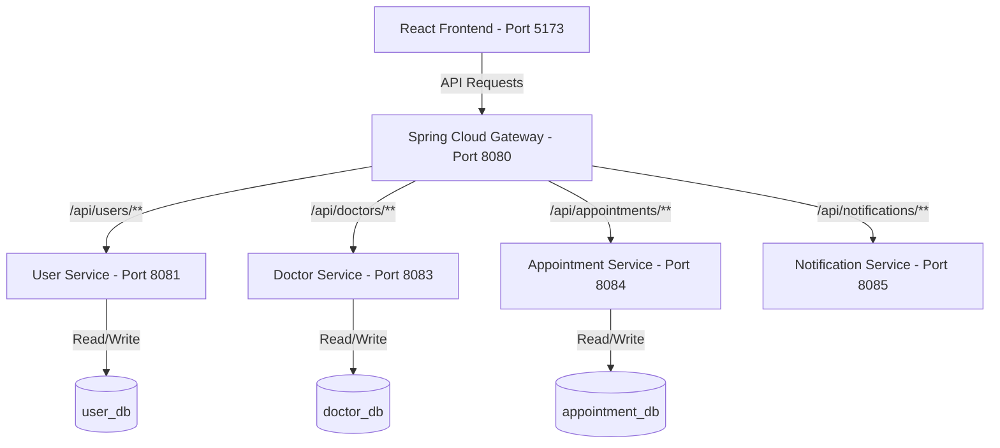

# 🏥 HealthSync - Doctor Appointment & Healthcare Management System

HealthSync is a enterprise-grade, container-orchestrated healthcare management platform. It provides a secure, fast, and interactive user experience for patients to discover doctors, view schedules, and book appointments, while offering specialized management interfaces for healthcare providers.

---

## 🚀 Key Features

*   **Doctor Discovery:** Search and filter doctors by specialization, hospital, experience, and location.
*   **Real-time Booking:** Real-time appointment scheduling with automated conflict detection and slot management.
*   **Secure Authentication:** User authentication utilizing JWT tokens, role-based access control, and Google OAuth integration.
*   **Microservices Backend:** Scalable, independent services built with Spring Boot and Spring Cloud.
*   **API Gateway:** Single-entry routing with built-in CORS handling, request mapping, and load sharing.
*   **Modern SPA Frontend:** Premium React application built with Vite, vanilla CSS, custom glassmorphism styling, and micro-animations.

---

## 📐 System Architecture

HealthSync utilizes a decentralized microservices architecture. Each subdomain is isolated into its own service with a dedicated PostgreSQL database to ensure loose coupling and high availability.



---

## 🐳 Running the Application with Docker (Recommended)

Docker Compose orchestrates the entire ecosystem (Frontend, API Gateway, all Microservices, and the PostgreSQL database container).

### Prerequisites
*   [Docker Desktop](https://www.docker.com/products/docker-desktop/) installed and running.
*   [Java 17+ / Maven 3.x](https://maven.apache.org/) (required only to pre-compile the backend JAR files).

### Quick Start Steps

1.  **Compile the Backend Services:**
    Navigate to the `Backend` directory and build the JARs:
    ```bash
    cd Backend
    mvn clean package -DskipTests
    cd ..
    ```

2.  **Spin Up the Stack:**
    Launch all services using Docker Compose:
    ```bash
    docker-compose up --build
    ```
    This will start the following containers:
    *   `healthsync-postgres`: Database engine hosting the microservice schemas on port `5432` internally.
    *   `user-service`: Running on port `8081`.
    *   `doctor-service`: Running on port `8083`.
    *   `appointment-service`: Running on port `8084`.
    *   `notification-service`: Running on port `8085`.
    *   `api-gateway`: Running on port `8080`.
    *   `healthsync-frontend`: Running on port `5173`.

3.  **Access the Application:**
    Open your browser and navigate to **`http://localhost:5173`**.

---

## 🛠️ Running the Application Normally (Locally)

To run the application without Docker, you will run the backend microservices as standard Spring Boot applications and the React frontend using the Vite development server.

### Prerequisites
*   **Java JDK 17** or higher.
*   **Node.js 22** or higher (with `npm`).
*   **Maven 3.x**.
*   **PostgreSQL** database engine installed and running locally.

### Step 1: Database Setup
The microservices require three separate databases to run. 

1.  Start your local PostgreSQL service.
2.  Connect to your PostgreSQL server using `psql` or an administration tool (like pgAdmin or DBeaver) and run the following queries to create the databases:
    ```sql
    CREATE DATABASE user_db;
    CREATE DATABASE doctor_db;
    CREATE DATABASE appointment_db;
    ```
3.  Ensure your default PostgreSQL user is `postgres` with the password `1234`. (If your local credentials differ, update them in each microservice's configuration: `application.yml` or `application.properties`).

### Step 2: Start the Backend Services
You must run the services in the following sequence so the database initialization completes before routing starts:

1.  Navigate to the `Backend` directory:
    ```bash
    cd Backend
    ```
2.  Build and install dependencies for the multi-module project:
    ```bash
    mvn clean install -DskipTests
    ```
3.  Open separate terminals to run each service:
    *   **User Service:**
        ```bash
        cd user-service && mvn spring-boot:run
        ```
    *   **Doctor Service:**
        ```bash
        cd doctor-service && mvn spring-boot:run
        ```
    *   **Appointment Service:**
        ```bash
        cd appointment-service && mvn spring-boot:run
        ```
    *   **Notification Service:**
        ```bash
        cd notification-service && mvn spring-boot:run
        ```
    *   **API Gateway:** (Run this last once all downstreams are initialized)
        ```bash
        cd api-gateway && mvn spring-boot:run
        ```

*Note: Database tables and seed data will be automatically generated by Flyway migrations on initial service startup.*

### Step 3: Start the Frontend Application

1.  Navigate to the `Frontend` directory:
    ```bash
    cd Frontend
    ```
2.  Install the required dependencies:
    ```bash
    npm install
    ```
3.  Create or verify the `.env` file in the `Frontend/` folder:
    ```env
    VITE_API_BASE_URL=http://localhost:8080
    VITE_GOOGLE_CLIENT_ID=your_google_client_id
    ```
4.  Run the Vite development server:
    ```bash
    npm run dev
    ```
5.  Access the web page at **`http://localhost:5173`**.

---

## 📂 Project Directory Structure

```
HealthSync/
├── Backend/                 # Microservices Backend Source Code
│   ├── api-gateway/         # Routing Gateway (Port 8080)
│   ├── user-service/        # Users & Authentication (Port 8081)
│   ├── doctor-service/      # Doctors profiles & slots (Port 8083)
│   ├── appointment-service/ # Bookings & appointments (Port 8084)
│   ├── notification-service/# SMTP email notification (Port 8085)
│   ├── pom.xml              # Maven parent pom config
│   └── init-db.sql          # Docker PostgreSQL auto-init script
├── Frontend/                # Single Page Application Frontend
│   ├── src/                 # React source code (Components, Pages, APIs)
│   ├── Dockerfile           # Frontend Docker container definition
│   └── package.json         # Node dependencies
├── docker-compose.yml       # Global orchestration configuration
└── README.md                # System documentation
```

---

## 📚 Detailed Documentation

For service-specific guides and troubleshooting:
*   [Backend Microservices Documentation (Backend/README.md)](file:///d:/HealthSync/Backend/README.md)
*   [Frontend Interface Documentation (Frontend/README.md)](file:///d:/HealthSync/Frontend/README.md)